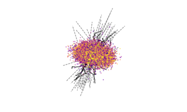

# Introduction
<div style="text-align:center;">


</div>

sfparticles is a simulation toolkit for particle tracking. 
Unklike particle-in-cell simulations, sfparticles does not solve field equations but instead tracks individual particles in pre-defined fields, without considering the inter-particle interactions. 
This allows for fast 3D simulations of large numbers of particles when plamsa denisty is low.

# Features
- **Numba Acceleration**: sfparticles leverages Numba to accelerate simulations by compiling Python code to machine code.
- **Cascade Simulation**: Optimized for exponentially growing number of particles.
- **Flexible Field Configuration**: sfparticles allows you to define complex electromagnetic fields using python functions.
- **Particle Tracking**: Track the trajectories of particles. see example.

# Installation

from github:
```bash
git clone https://github.com/xsgeng/sfparticles.git
cd sfparticles
pip install --user -e .
```

from pypi:

```bash
pip install sfparticles
```

# Usage

## Basic Simulation

To run a basic simulation, you can refer to the example scripts provided in the `examples` directory. For instance, to simulate a particle cascade, you can use the `cascade.py` script:

```bash
python examples/cascade.py
# set number of threads
NUMBA_NUM_THREADS=64 python examples/cascade.py
```

For trajectory simulations, you can use the `trajectory.py` script:

```bash
python examples/trajectory.py
```

## Advanced Settings

You can set environment variables to configure the simulation. For example, to use an optical depth radiation model, set the `SFPARTICLES_OPTICAL_DEPTH` environment variable:

```bash
SFPARTICLES_OPTICAL_DEPTH=1 python examples/cascade.py
```

## GPU Acceleration

For even faster simulations, sfparticles supports GPU acceleration. To enable this feature, you need to install CUDA and set `SFPARTICLES_USE_GPU=1` environment variable. 

**Note**: GPU is slow for small number of particles.

### Installing CUDA

```bash
conda install -c conda-forge cupy cudatoolkit=11.2
```

### Enabling GPU Acceleration

```bash
SFPARTICLES_USE_GPU=1 python examples/cascade.py
```

For Slurm job schedulers, you can use the following command:

```bash
SFPARTICLES_USE_GPU=1 srun -p gpu -G 1 -u python examples/cascade.py
```